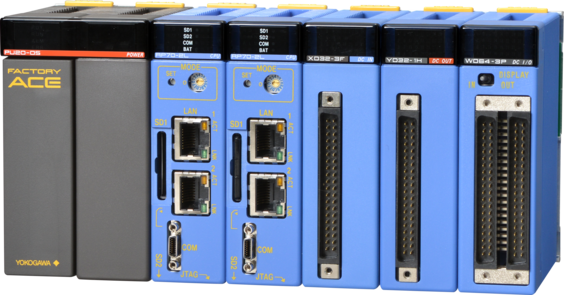

# F3RP70 Support

This is the base Nerves System configuration for the F3RP70,
[e-RT3 Products, OS-free CPU module](https://www.yokogawa.com/solutions/products-platforms/control-system/ert3-embedded-controller/ert3-products/ert3-products-cpu/).


<br><sup>[Image is provided by Yokogawa Electric Corporation](https://www.yokogawa.com/)</sup>

| Feature              | Description                                                 |
| -------------------- | ----------------------------------------------------------- |
| CPU                  | ARM Cortex-A9 MPCore (Dual) 866 MHz                         |
| Memory               | 1 GB SDRAM                                                  |
| Storage              | 256MB Flash and Two SD slots (SD1/SD2)                      |
| Linux kernel         | 4.14.164 w/ 4.14.164-rt73 and ert3xlnx patch                |
| IEx terminal         | UART `ttySP0`                                               |
| GPIO, I2C, SPI       | No                                                          |
| ADC                  | No                                                          |
| PWM                  | No                                                          |
| UART                 | ttySP0                                                      |
| Display              | No                                                          |
| Camera               | No                                                          |
| Ethernet             | Two 1Gbps (eth0 and eth1)                                   |
| WiFi                 | No                                                          |
| Bluetooth            | No                                                          |
| Audio                | No                                                          |
| RTC                  | Yes w/ battery                                              |


## Using

This port currently only runs off a SD card.

If you need custom modifications to this system for your device, clone this
repository and update as described in [Making custom systems](https://hexdocs.pm/nerves/systems.html#customizing-your-own-nerves-system)


## Networking

The board has two 1 Gbps Ethernet interfaces. Here's an example `:vintage_net`
configuration that enables both of them:

```elixir
config :vintage_net,
  config: [
    {"eth0",
     %{
       type: VintageNetEthernet,
       ipv4: %{
         method: :static,
         address: "192.168.3.72",
         prefix_length: 24,
         gateway: "192.168.3.1",
         name_servers: ["192.168.3.1"]
       }
     }},
    {"eth1",
     %{
       type: VintageNetEthernet,
       ipv4: %{method: :dhcp}
     }}
  ]
```

